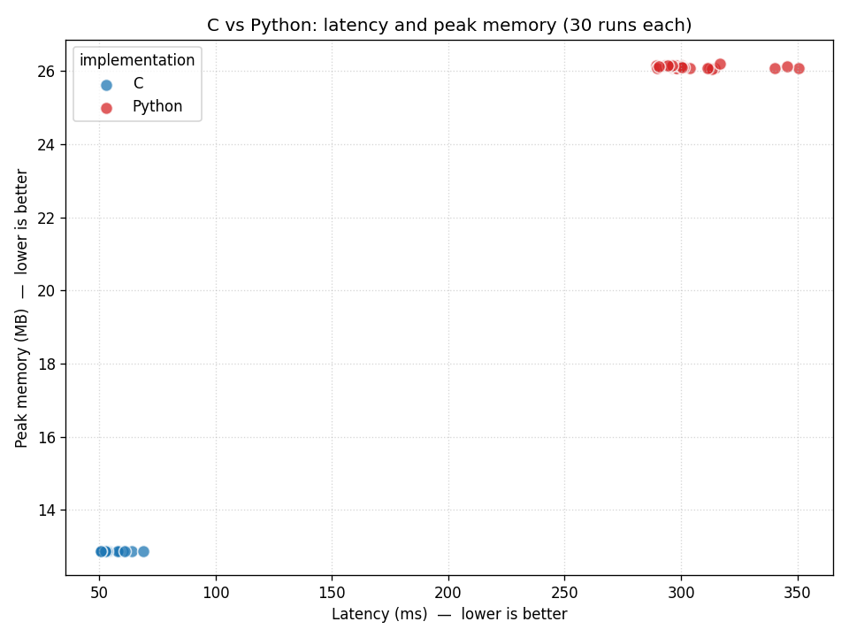

# API Project — Entity & Relationship Graph Monitor

An in-memory directed graph that tracks **entities** and the typed **relationships**
between them, and reports — for each relationship type — the entity (or entities)
with the most incoming relationships of that type.

This was my project for the *Algoritmi e Principi dell'Informatica* (Algorithms and
Principles of Computer Science) course during my bachelor's degree at Politecnico di
Milano. The grade was driven by an automated evaluator that scored both **execution
time** and **memory footprint**, so the implementation is deliberately tuned for
performance rather than brevity.

**Final mark: 30/30 cum laude.**

## Overview

The program reads a stream of commands from standard input. Entities and relationships
are created and removed on the fly, and at any point a `report` command prints, per
relationship type, which entities are currently "most pointed at" and how many incoming
relationships of that type they have. The program runs until it reads `end`.

## Build

Requires a C compiler (`gcc`) and `make`.

```sh
make          # compiles src/main.c into bin/api
make clean    # removes the bin/ directory
```

## Test

Golden-snapshot tests feed each command stream to the program and diff its output
against a committed baseline. The suite covers the large `examples/doctor_who.txt`
scenario plus a set of focused basic-case checks in [`tests/`](tests/):

```sh
make test       # run the C binary against every snapshot
make test-py    # run the Python port (python/api.py) against the same snapshots
```

`make test` runs in CI on every push and pull request
(see [`.github/workflows/ci.yml`](.github/workflows/ci.yml)). To regenerate a baseline
after intentionally changing an input, run e.g.
`./bin/api < examples/doctor_who.txt > examples/doctor_who.expected.txt`.

## Usage

The program reads commands from `stdin` and writes results to `stdout`:

```sh
./bin/api < examples/doctor_who.txt
```

or, equivalently, build-and-run the interactive prompt with:

```sh
make run
```

## Commands

| Command | Form | Effect |
| --- | --- | --- |
| `addent` | `addent "<ent>"` | Add entity `<ent>` to the graph (no-op if it already exists). |
| `addrel` | `addrel "<orig>" "<dest>" "<rel>"` | Add a relationship of type `<rel>` from `<orig>` to `<dest>` (both entities must exist). |
| `delrel` | `delrel "<orig>" "<dest>" "<rel>"` | Remove the `<rel>` relationship from `<orig>` to `<dest>`. |
| `delent` | `delent "<ent>"` | Remove `<ent>` and every relationship in which it takes part. |
| `report` | `report` | Print, for each relationship type, the entities with the most incoming relationships. |
| `end` | `end` | Terminate the program. |

## Input / output format

- Every entity and relationship name is given as a **double-quoted** string.
- Relationships are **directed**: `addrel "A" "B" "knows"` counts as one *incoming*
  `knows` relationship for `B`.
- `report` prints one line. For each relationship type that currently has at least one
  relationship, it emits a space-separated segment:

  ```
  "<rel>" "<ent>" ["<ent>" ...] <max_count>;
  ```

  where the listed entities are exactly those tied for the highest number of incoming
  relationships of that type, sorted by name, and `<max_count>` is that maximum.
  Segments are ordered by relationship name. If no relationships exist at all, the line
  is just:

  ```
  none
  ```

### Example

```
addent "a"
addent "b"
addent "c"
addrel "a" "c" "knows"
addrel "b" "c" "knows"
addrel "a" "b" "knows"
report
end
```

`c` receives two incoming `knows` relationships and `b` one, so `report` prints:

```
"knows" "c" 2;
```

A larger, runnable command stream is provided in
[`examples/doctor_who.txt`](examples/doctor_who.txt).

## Design notes

The implementation favors incremental, performance-oriented data structures:

- **Entities** live in an open-addressing hash table of `entity *` (power-of-two slots,
  linear-probe, FNV-1a, grown and rehashed at ~0.7 load) — no per-entity chaining, so a
  lookup touches a contiguous probe sequence rather than chasing list nodes. A controlled
  before/after on the same machine attributes **~6–8% lower end-to-end latency** to this
  change vs the previous chained table, with peak memory unchanged (≈3% from the cheaper
  mask/FNV index, the rest from cache locality).
- **Relationships** are stored per entity. For each relationship type an entity takes
  part in, it keeps two compact open-addressing hash sets of `entity *` (stored inline,
  power-of-two, grown and rehashed at ~0.7 load): `targets` (the entities it points to)
  and `sources` (the entities pointing back at it). `sources` is a **reverse index**:
  it lets `delent` reach an entity's in-neighbours directly, so removing an entity costs
  O(its degree) instead of scanning the whole graph. Storing `entity *` inline (no
  per-edge node, no fixed-width bucket table) also keeps the structure small.
- A separate **"current maxima"** structure (`relation_max`) is maintained incrementally
  as relationships are added and removed, so that `report` mostly reads off precomputed
  results instead of scanning the whole graph on every call. A full rescan
  (`recompute_max`) is only triggered when the reigning maximum for a relationship type
  is actually torn down.
- **Input** is read through a block-buffered, unlocked reader (`next_char`, 64 KiB blocks)
  rather than per-character `getchar`/`scanf`, which avoids libc stream-locking overhead on
  the hot parsing path while keeping memory flat (one fixed buffer, not the whole input).

## A readable Python port

[`python/api.py`](python/api.py) is a second implementation of the exact same command
language, written for clarity rather than speed. Where the C version maintains the
running maxima incrementally with hand-rolled hash tables, the Python version keeps a
plain `dict` of `set`s and simply **recomputes** the maxima on each `report`. It produces
byte-for-byte identical output, so it passes the same snapshot suite (`make test-py`):

```sh
python3 python/api.py < examples/doctor_who.txt
```

## C vs Python: performance comparison

The two implementations solve the same problem with opposite priorities — the C version
is optimized; the Python version is deliberately simple. The benchmark harness
[`bench/benchmark.py`](bench/benchmark.py) quantifies the difference on a single shared,
deterministic workload (3,000 entities, 120,000 `addrel` operations, interleaved
`report`s, plus some `delrel`/`delent` churn). It first verifies that both programs
produce identical output, then runs each one 30 times, recording:

- **latency** — end-to-end wall-clock time per run (`time.perf_counter`), which includes
  process/interpreter startup, and
- **peak memory** — the process's high-water-mark RSS (`os.wait4` → `ru_maxrss`).

Reproduce it with:

```sh
make bench      # pip install matplotlib, run the harness, regenerate the plot below
```

### Results (median of 30 runs)

| Implementation | Latency | Peak memory |
| --- | --- | --- |
| C (`bin/api`) | **53 ms** | **13 MB** |
| Python (`python/api.py`) | 299 ms | 26 MB |
| Ratio (Python / C) | ~5.6× slower | ~2.0× more |

Plotting every run on a memory-vs-latency scatter, the two implementations form two
clearly separated clusters: C sits in the fast, light corner; Python trades both away for
a much shorter, more readable program.



(Raw measurements are written to [`bench/results.csv`](bench/results.csv). Absolute
numbers depend on the machine — note that on this environment RSS has an ~10 MB floor that
both binaries hit on small inputs, so the memory gap only opens up once the dataset grows.)

## Project structure

```
.
├── .github/
│   └── workflows/
│       └── ci.yml                  # build + test on push / pull request
├── src/
│   └── main.c                      # the optimized C program (single translation unit)
├── python/
│   └── api.py                      # readable, non-optimized Python port
├── bench/
│   ├── benchmark.py                # C-vs-Python latency/memory harness + plot
│   ├── requirements.txt            # matplotlib (for the plot)
│   ├── results.csv                 # raw measurements from the latest run
│   └── benchmark.png               # memory-vs-latency scatter plot
├── examples/
│   ├── doctor_who.txt              # a sample command stream
│   └── doctor_who.expected.txt     # expected output for the sample (test baseline)
├── tests/                          # focused basic-case snapshot pairs (*.txt / *.expected.txt)
├── Makefile
├── README.md
└── LICENSE
```

## License

See [LICENSE](LICENSE).
